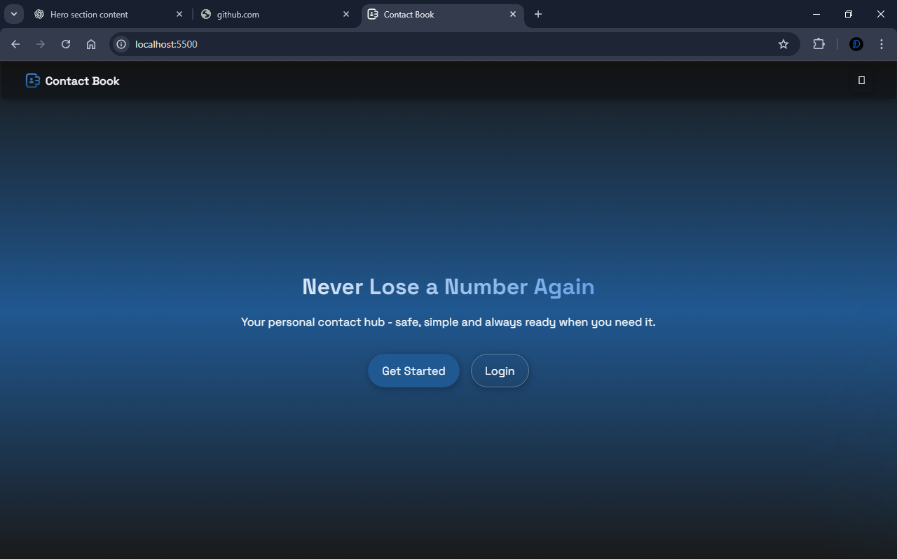
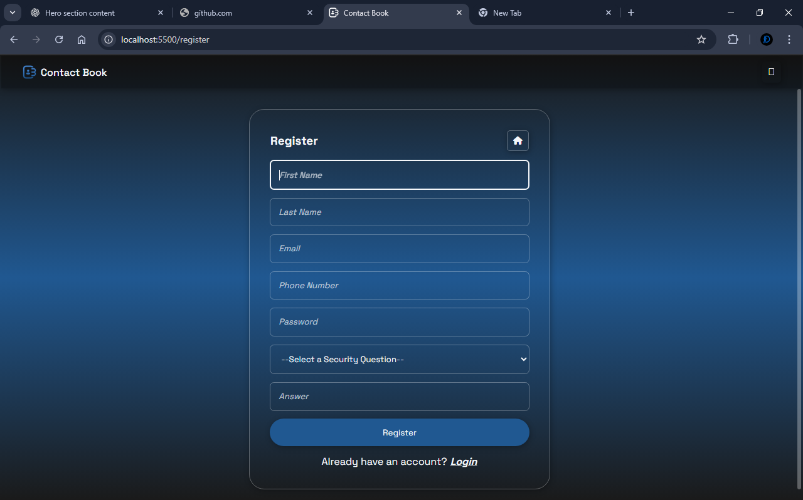
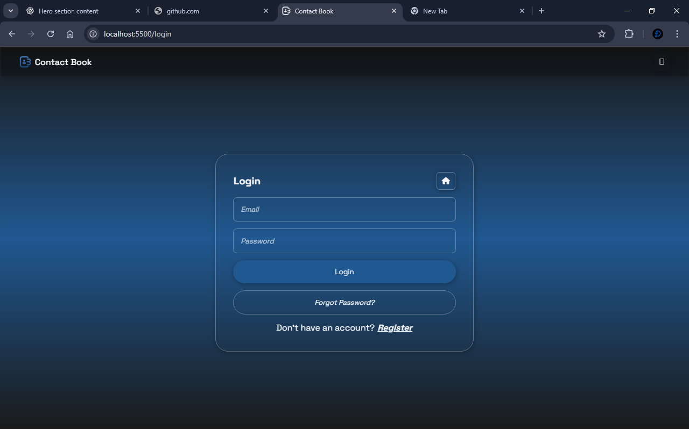
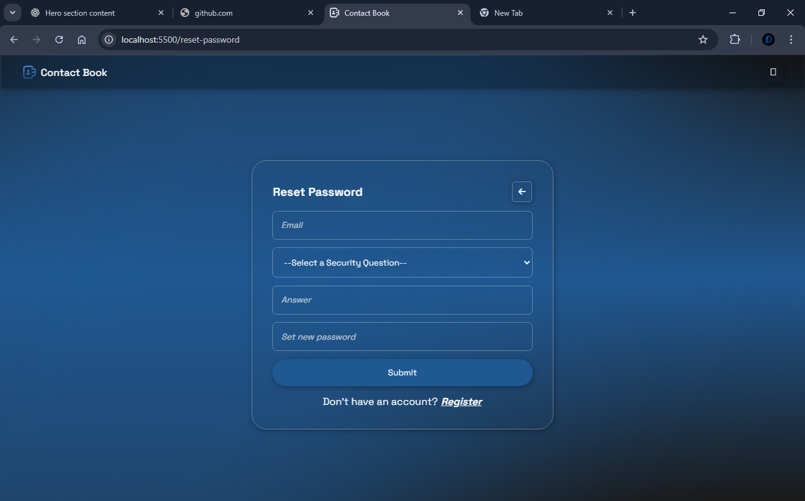
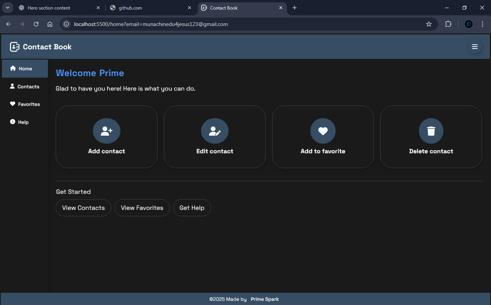
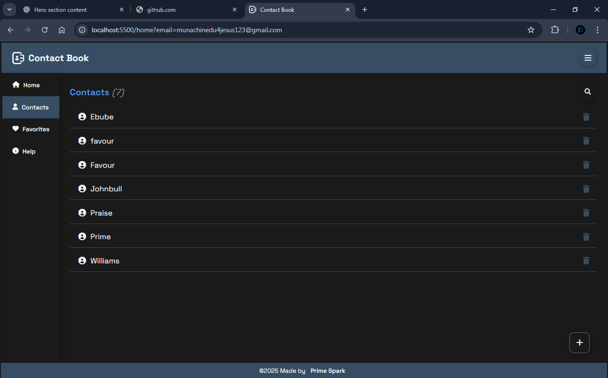
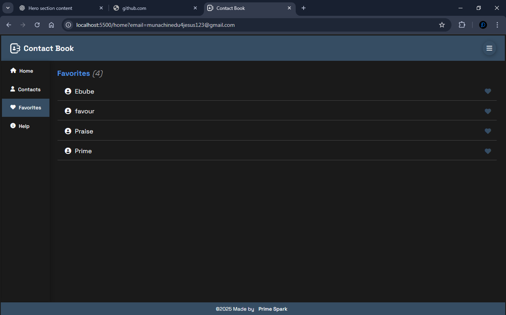
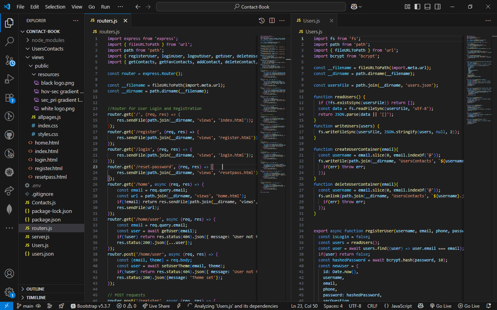

# 📇 Contact Book

A simple Contact Book web app for storing and managing contacts locally.  
Built with **HTML, CSS, and Node.js (Express)** using **JSON file storage** — no database needed.  

---

## 🚀 Features
- **User Registration** – Create an account with credentials, password, and a security question.
- **User Login** – Secure login using stored JSON data.
- **Forgot Password** – Reset password via security question and email.
- **Contact Management** – Add, view, edit, delete and toggle favorite contacts.
- **Persistent Storage** – Data is stored in a local JSON file and stays even after restarting the server.
- **Responsive Design** – Works well on desktop and mobile devices.

---

## 🛠️ Tech Stack
- **Frontend:** HTML, CSS, JavaScript
- **Backend:** Node.js, Express
- **Storage:** JSON file (local storage on server)

---

## 📂 Project Structure

Contact-Book/
- ├── UsersContacts/ *Stores user's contacts*
- ├── views/ *Frontend files*
- │ ├── public/ *Frontend CSS and JS*
- │ │ ├── resources/ *images*
- │ │ ├── home.html *Home page where users modify their contacts*
- │ │ ├── index.html *Landing page*
- │ │ ├── login.html *Login page*
- │ │ ├── register.html *Registration page*
- │ │ ├── resetpass.html *Password reset page*
- ├── Contacts.js *Handles contacts requests*
- ├── routers.js *Routes for all requests*
- ├── server.js *Main server*
- ├── Users.js *Handles users requests*
- ├── users.json *Stores user accounts*
- ├── package.json *Project details & dependencies*
- └── README.md *Documentation*

---

## ⚙️ Installation
1. **Clone this repository:**
   ```bash
   git clone https://github.com/your-username/contact-book.git
   cd contact-book

2. **Install dependencies:**
   ```bash
   npm install

3. **Run the app:**
   ```bash
   npm run dev
  
`App will run at http://localhost:5500`

---

##  🔑 Usage
1. Open index.html.
2. Register with a username, password, and security question.
3. Login with your credentials.
4. Manage Contacts (add, view, edit, delete, toggle favorite).
5. Use Forgot Password if needed.

---

## ⚠️ Disclaimer
This project is intended **solely for educational purposes** and is not designed, tested, or secured for real-world, production-level use.  

While it demonstrates core programming concepts such as:
- User authentication
- Data handling with JSON
- Basic password hashing

…it **does not** implement the advanced security measures, scalability practices, or robust error handling required for professional applications.  

**Do not** store or use real, sensitive, or personal data (such as actual passwords, phone numbers, or emails) in this project.  
The application should only be used in a local or test environment for learning and experimentation.

By using this project, you acknowledge that the author(s) hold **no responsibility** for any data loss, misuse, or security breaches that may occur.

---

## 📜 License
This project is free to use and modify.

---

## 📸 Screenshots

### 🛬 Landing Page


### 📝 Registration Page


### 🔐 Login Page


### 🛠 Reset Password Page


### 🏠 Home Page


### 👨‍👩‍👧‍👦 Contacts Section


### 💑 Favorite Contacts Section


### 💻 Code

